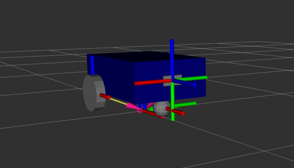
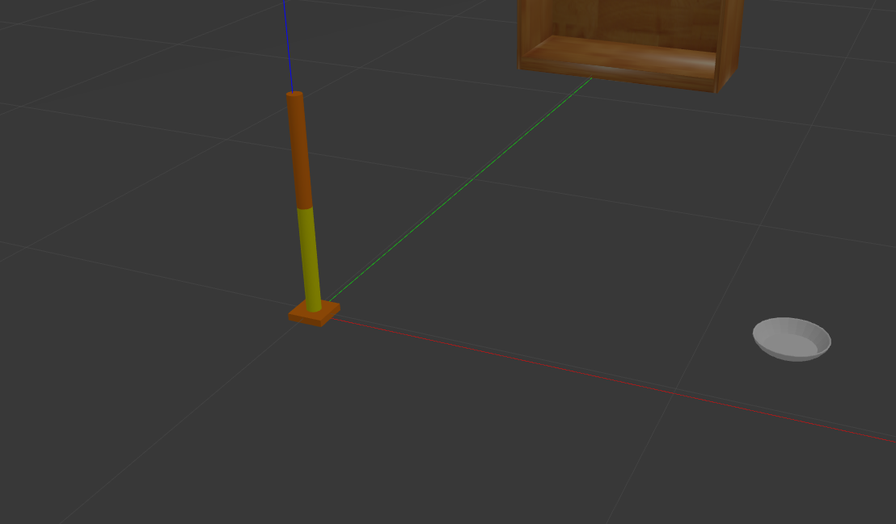
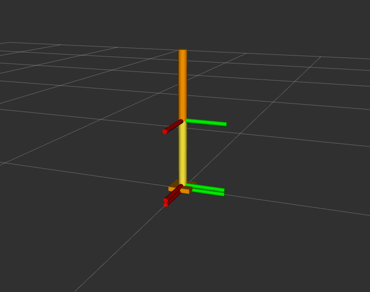
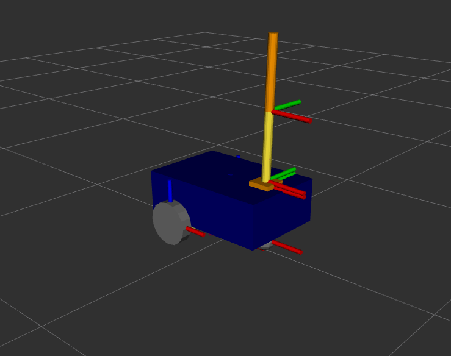
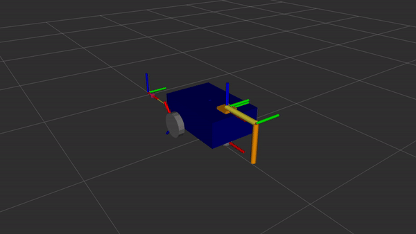

1. TF
2. URDF
3. Robot State Publisher & Joint State Publisher
4. URDF with Xacro
5. Advanced Launch XML & Py
6. Rviz & Gazebo
7. Sensors & Plugins in Gazebo




**How to run:**

**build:**

`colcon build`

`source install/setup.bash`

**Running Rviz & Gazebo (simulation)** 
```bash
ros2 launch my_robot_bringup my_robot_gazebo.launch.xml
```

**Control wheels** 
```bash
ros2 topic pub /cmd_vel geometry_msgs/msg/Twist "{linear: {x: 0.3}}
```

**Control arm** 
```bash
ros2 topic pub -1 /set_joint_trajectory trajectory_msgs/msg/JointTrajectory '{header:
{frame_id: base_footprint}, joint_names: [arm_base_forearm_joint, forearm_hand_joint],
points: [ {positions: {0.2, 0.5}} ]}'
```



